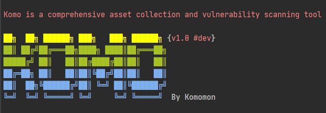

# Komo

```python
Komo is a comprehensive asset collection and vulnerability scanning tool

██╗  ██╗ ██████╗ ███╗   ███╗ ██████╗ {v1.0 #dev}
██║ ██╔╝██╔═══██╗████╗ ████║██╔═══██╗
█████╔╝ ██║   ██║██╔████╔██║██║   ██║
██╔═██╗ ██║   ██║██║╚██╔╝██║██║   ██║
██║  ██╗╚██████╔╝██║ ╚═╝ ██║╚██████╔╝
╚═╝  ╚═╝ ╚═════╝ ╚═╝     ╚═╝ ╚═════╝  By Komomon

```



## Intro&&Feature

🚀**Komo**是一个综合资产收集和漏洞扫描工具，通过多种方式对子域进行获取，收集域名邮箱，进行存活探测，域名指纹识别，域名反查ip，ip端口扫描，web服务链接爬取并发送给xray，对web服务进行漏洞扫描，对主机进行主机漏洞扫描。

🚋**Komo**集成了**oneforall**，**subfinder**，**ksubdomain**，**amass**，**ctfr**，**emailall**，**httpx**，**naabu**，**ehole**，**goon3**，**crawlergo**，**rad**，**gospider**，**URLfinder**，**vscan**，**nuclei**，**afrog**，**vulmap**，**xray**等，全自动化、智能化工具。本工具依托各工具特色，进行模块化构建。

Komo的目的为了一键化，便捷性，可移植性，便于打点和红队外围渗透工作，所以将基于模块化开发，所有工具都汇总到统一接口，以便于下一个模块调用和后续某模块新增工具。**==如果你有好的工具和改进建议，可以添加下面的公众号群聊来沟通==**。

Komo的每个模块可以单独拿出来直接使用，每个模块下面都有一个main，注意工具下载到对应目录下即可。

Komo可以自动下载所需的所有工具，不用使用者自己下载所有工具，使用`python3 Komo.py install` 即可，同时也便于移动，这保证了Komo的体积足够精简。


## Project structure


## Usage

安装`python3`（`python2`暂时不支持）

安装相应的库文件`pip3 install -r requirements.txt`

第一次使用下载所需工具

```python
python3 Komo.py install
```

如下图所示，如果下载失败，则需要手动去下载对应工具到对应目录。


**Komo 支持多种模式**

> collect:只资产收集，多种方式收集域名，收集域名邮箱，域名存活探测，域名反查ip，域名指纹识别，ip端口扫描，web服务链接爬取
>
> all: 资产收集+攻击，多种方式收集域名，收集域名邮箱，域名存活探测，域名反查ip，域名指纹识别，ip端口扫描，web服务链接爬取，将爬取的链接发送给xray进行扫描，反查的ip进行其他端口漏洞扫描
>
> subdomain: 通过多种方式进行域名收集，dns爆破，证书获取，DNS运营商处获取。
>
> finger: 对收集到的域名或域名文件进行存活探测和指纹识别（Ehole+wapplyzer）
>
> portscan：对反查的ip列表或ip文件进行端口扫描
>
> sensitive：对收集到的存活域名或域名文件进行url爬取
>
> webattack：对收集到的存活域名或域名文件进行url爬取，然后发送给xray进行扫描，同时也调用nuclei，afrog，vulmap，vscan进行漏洞扫描
>
> hostattack：对反查的ip列表或ip文件进行常见服务弱口令扫描和漏洞扫描

**all 全扫描**

```python
python3 Komo.py --domain example.com all
python3 Komo.py --domains ./domains.txt all
```

**collect**

```python
python3 Komo.py --domain example.com collect
python3 Komo.py --domains ./domains.txt collect
```

**subdomain**

```python
python3 Komo.py --domain example.com subdomain
python3 Komo.py --domains ./domains.txt subdomain
```

**finger**

```python
python3 Komo.py --url http://example.com finger
python3 Komo.py --urls ./urls.txt finger
```

**sensitive**

```python
python3 Komo.py --url http://example.com sensitive
python3 Komo.py --urls ./urls.txt sensitive
```

**webattack**

```python
python3 Komo.py --url http://example.com webattack
python3 Komo.py --urls ./urls.txt webattack
```

**portscan**

```python

python3 Komo.py --ip example.com portscan
python3 Komo.py --ips ./domains.txt portscan
```

**hostattack**

```python
python3 Komo.py --ip example.com hostattack
python3 Komo.py --ips ./domains.txt hostattack
```

## **完整Usage**

```python
Komo help summary page

Komo is an automated scanning tool set

    mode:
    install     Download the required tools
    all         all scan and attack
        --domain    one domain
        --domains   a domain file
    collect     run all collection modules :subdomain, finger, port, sensitive, poc, to_xray
        --domain    one domain
        --domains   a domain file
    subdomain   only collect subdomain
        --domain    one domain
        --domains   a domains file
    finger      only collect the survival URL and  fingerprint
        --url       one url
        --urls      an urls file
    portscan    only collect port from ip or ips
        --ip        one ip
        --ips       an ips file
    sensitive   only collect directory with crawl,email
        --url       one url
        --urls      an urls file
    webattack   only attack web from url or urls
        --url       one url
        --urls      an urls file
    hostattack  only attack ip from ip or ips
        --ip        one ip
        --ips       an ips file

    Example:
        python3 Komo.py install
        python3 Komo.py --domain example.com all
        python3 Komo.py --domains ./domains.txt all
        python3 Komo.py --domain example.com collect
        python3 Komo.py --domains ./domains.txt collect
        python3 Komo.py --domain example.com subdomain
        python3 Komo.py --domains ./domains.txt subdomain

        python3 Komo.py --url http://example.com finger
        python3 Komo.py --urls ./urls.txt finger
        python3 Komo.py --url http://example.com sensitive
        python3 Komo.py --urls ./urls.txt sensitive
        python3 Komo.py --url http://example.com webattack
        python3 Komo.py --urls ./urls.txt webattack

        python3 Komo.py --ip example.com portscan
        python3 Komo.py --ips ./domains.txt portscan
        python3 Komo.py --ip example.com hostattack
        python3 Komo.py --ips ./domains.txt hostattack

```


## 日志

 

### 修改的模块

    oneforall model下添加了一个othertools.py模块
    hakrawler 修改编译的添加了一个-f参数
    emailall修改了
    其他的暂时没想起来


### 20220904
    子域名收集模块完成
    
    指纹识别模块完成
        
        目前使用的是httpx ehole
    
    portscan扫描模块
    
        目前用的naabu，可以看下其他的有没有好用的
    
    sensitiveinfo识别模块差不多，目前有crawlergo rad 
        crawlergo rad  获取的links存到了 {domain}.links.txt
        不过要给xray还是要json原格式才可以
    
    打算再加一个jsfinder


​    

    vulscan
    
        实现了afrog nuclei 和 xray的主动扫描，暂时未开启

todo

    总main，没弄呢， #可以每个域名加一个当前时间的时间戳
    端口扫描端口指纹识别，要在加点工具
    敏感信息识别模块 加上urlfinder dirsearch
    vulsan在加点个未授权端口扫描
    
    进度记录的方式，比如有一个初始化都为0的json文件记录，跑完的模块置为1

### 20220906

    完成了四个模块的domain串行扫描、urlsfile模块扫描、单个url扫描功能
    可以实现单模块拿出来直接用
    
    sensitiveinfo模块
        
        增加了URLFinder
        增加了attackflag标识符，可以实现爬取crawlergo rad URLFinder结果发送给xray进行主动扫描
        将多个工具爬取到的method url headers body 存储到{domain}.links.csv


todo
    
    总main，没弄呢
    端口扫描端口指纹识别，要在加点工具，支持识别udp端口的
    vulsan在加点个未授权端口扫描,主机扫描工具
    进度记录的方式，比如有一个初始化都为0的json文件记录，跑完的模块置为1
    把敏感目录扫描加进去

### 20220907

    今天完善了main，domain finger sensitive vulscan 在main中实现调用
    
    domain finger sensitive vulscan 四个模块实现了顺序模块扫描，也实现了单独使用的时候指定单url 单urlsfile
    vulscan的main分成了两个webmanager和hostmanager分别对web和ip进行漏洞扫描
    
    hostmanager加上一个goon,去识别指纹和对端口服务进行弱口令扫描


​    
todo

    vulscan指定ip ipfile的部分代码还没加上
    端口扫描端口指纹识别工具还要再找找看
    进度记录的方式，比如有一个初始化都为0的json文件记录，跑完的模块置为1
    把敏感目录扫描加进去


### 20220908

    sensitive 加了emailall gospider hakrawler urlcollector（暂未开启，请求谷歌容易被墙，有认证）
    敏感目录扫描 看了个戴拿扫描，不好用，同时扫敏感目录容易被直接ban掉，故未开启
    vulscan的主机扫描模块
        将goon加到了主机扫描模块，并且支持顺序扫描和单模块提供ip扫描，暂未实现指定c段扫描
    vulscan的web扫描模块  
        支持顺序扫描，支持单模块单独url 多个urlfile使用
    
    domain finger portscan sensitive vulscan都加了一个run，支持和单模块使用，方式类似oneforall
    
    在总main中把portscan加进去了

todo


    端口扫描端口指纹识别工具还要再找找看


### 20220910

    进度记录的方式在domain_main 添加测试了一下，最后去除了，不太好实现通用性，因为涉及到读取状态，更新动态修改状态
    添加了vscan
    在测试sbscan

todo
    
    sbscan改了默认截图的参数为False,还未编译成功明天看看
    同时看一下还会不会在自动下载chrome
    再测一下ssbscan，然后加进去
    加进去之后看一下vscan要不要去掉
    进度记录的方式，比如有一个初始化都为0的json文件记录，跑完的模块置为1

### 20220911

    vulscan模块的hostmanager添加了SweetBabyScan
    sbscan改了默认截图的参数为False，再编译的，但是默认还是会下载chrome
    vulscan模块的hostmanager vscan保留了


​    
todo
​    
    总main webattack hostattack 还需要再修改一下填补一下
    进度记录的方式，比如有一个初始化都为0的json文件记录，跑完的模块置为1    


### 20220911

    总main webattack hostattack 修补好了,url urlsfile ip ipfile修补好了
    finger模块添加了webanalyze 进行指纹识别
    到此整体模块设计完成。

todo

    dismap 加到端口扫描，naabu是否弃用
    代码优化，装饰器加上
    子线程执行和主线程执行对比
    增加进度记录，进度记录的方式，比如有一个初始化都为0的json文件记录，跑完的模块置为1    
    主域名，备案信息收集待做
    再测一下这个工具
    nmaps.exe -iL 1.txt -top-ports -nC -source-ip 8.8.8.8 -o 22.txt -silent -retries 2
    
    gospider 会一直深度遍历下去，最好用子线程限制时间   已完成
    gospider中的sudomain先获取再讲点转为_     已完成
    gospider 中的输出文件要先判断有无在读取，同模块其他函数的或者其他模块的都要这样弄   已完成
    有的工具zaivps2012上执行不了想办法跳过，不要阻碍整体执行 urlfinder？
    
    增加logger的log文件  已完成
    函数多加try log文件记录出错函数内容，以便于回顾发现问题，哪个部分没跑成     已完成
    
    gospider子线程超时会挑出结束主线程？ 已解决加了try  已解决
    hostmanager 中vscan有点问题，执行不下去还直接跳出使得主线程终止  已解决，设置的sttout stterro不合适的原因


​    
​    
​    
​    
### 20220919

    vulscan 全部改成线程执行模式，__subprocess1(cmdstr, timeout=1800)，  已完成
    设置超时时间，默认1800s
    全部模块都加了@logger.catch 捕获错误，并存入log文件
    所有main函数都加--date函数，用于当整体扫描断了指定domain和date 和指定模块继续扫描

todo
    
    过程记录还没写
    dismap 加到端口扫描，naabu是否弃用
    代码优化，装饰器加上
    子线程执行和主线程执行对比
    增加进度记录，进度记录的方式，比如有一个初始化都为0的json文件记录，跑完的模块置为1    
    主域名，备案信息收集待做
    再测一下这个工具
    nmaps.exe -iL 1.txt -top-ports -nC -source-ip 8.8.8.8 -o 22.txt -silent -retries 2
    有的工具zaivps2012上执行不了想办法跳过，不要阻碍整体执行 urlfinder？


​    
    gospider中的sudomain先获取再讲点转为_         已修复，不要修改subdomain全局，否则其他工具调用输出文件会有问题
        gospider的输出是 xx_xx_xx ip xx_xx_xx_xx 都不带端口
    urlfinder 的输出结果是domain:port.csv ip:port.csv 如果有port的话   已修复，不要修改subdomain全局，否则其他工具调用输出文件会有问题
    sbscan的输出结果文件名域名的时候也是data.SWeetbabyscan.xlsx?  已修复，main添加output_filename_prefix
    afrog_log的目录应该在vulscan_scan下            已修复


​    
    已完成：
        crawlergo rad的url存起来            已完成
        其他工具的进行对比，不存在的再发个xray，减少请求量，发现原来已经完成过了，只是每次都判断7777端口有冗余 已完成
        xray的扫描方式，xss去掉
        添加gau                           已添加
    
    sensitive runcmd 函数化          已完成 使用__subprocess1() __subprocess2() 
    最后存储csv函数化                  已完成
    结果to_xray 函数化                已完成


​    
    emailall 要不要剥离出来
    看一下线程执行命令方法，执行命令不行加上cwd，因为某些工具有config 如emailall xray oneforall
    emailall 有报错可能要魔改一下                             已完成
    下载文件自动解压到指定目录的函数看下其他工具 appinfoscan？  已完成


### 20220925

    增加自动下载工具的模块，方便迁移
    emailall 报错修改完成
    rad执行命令不能将结果输入管道，修改了__subprocess1() 中为Popen(cmd,shell=True)
    添加了logo正式命名为Komo


todo
    
    naabu 默认扫描一百个端口是否够
    naabu对接给nmap要不要加一下
    进度记录


​    